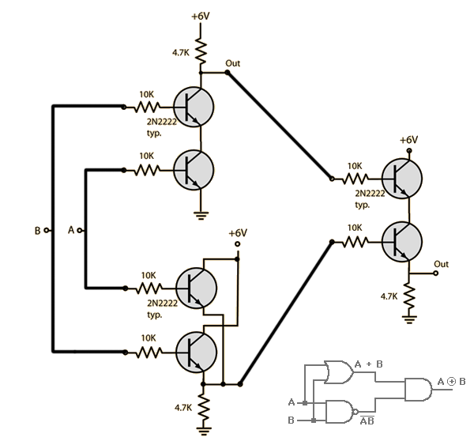

Three major components are required to implement a digital system: combinational logic
to compute functions on the bits, memory elements to store bits, and clock signals
to regulate the updating of the memory elements.

## Logic Gates
Loginc gates are the baisc computing elements for digital circuits. They generate an output equal to
some Boolean function of the bit values at their inputs.

> An example of XOR gate
> 

## Memory and Clocking

- Clocked registers store individual bits or words. The clock signal controls the loading of the register with the value at its input
- Random access memories store multiple words, using ad address to select which  word should be read or written. Examples:
1) the virtual memory system if a processor, where a combination of hardware and operating system software make it appear to a processor that it can access any word within a very large address space, and 
2) the register file, where register identifiers serve as the addresses.

