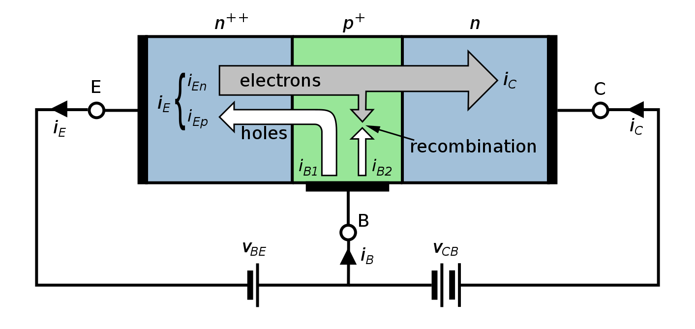

## How a junction transistor works
JTs exist as PNP and NPN types, based on the doping types of the three main terminal regions. An NPN transistor comprises two semiconductor junctions that share a thin p-doped region, and a PNP transistor comprises two semiconductor junctions that share a thin n-doped region. N-type means doped with impurities that provide mobile electrons, while P-type means doped with impurities that provide holes that readily accept electrons.

Charge flow in a BJT is due to diffusion of charge carriers(载流子) across a junction between two regions of different charge carrier concentration. The regions of a BJT are called emitter, base, and collector.[b] A discrete transistor has three leads for connection to these regions. Typically, the emitter region is heavily doped compared to the other two layers, and the collector is doped more lightly than the base (collector doping is typically ten times lighter than base doping [2]). By design, most of the BJT collector current is due to the flow of charge carriers (electrons or holes) injected from a heavily doped emitter into the base where they are minority carriers that diffuse toward the collector, and so BJTs are classified as minority-carrier devices.
In typical operation, the base–emitter junction is forward-biased, which means that the p-doped side of the junction is at a more positive potential than the n-doped side, and the base–collector junction is reverse-biased. When forward bias is applied to the base–emitter junction, the equilibrium between the thermally generated carriers and the repelling electric field of the n-doped emitter depletion region is disturbed. This allows thermally excited electrons (in an NPN; holes in a PNP) to inject from the emitter into the base region. These electrons diffuse through the base from the region of high concentration near the emitter toward the region of low concentration near the collector. The electrons in the base are called minority carriers because the base is doped p-type, which makes holes the majority carrier in the base. In a PNP device, analogous behaviour occurs, but with holes as the dominant current carriers.

## DRAM cell and transistor

When a HIGH voltage (equivalent to bit '1') is sent, the MOS gate gets a high voltage and turns on. Suppose the data line now has a high bit '1', then the channel formation of the MOS ensures that the capacitor too, charges up to a high voltage, storing a '1'. For a '0' on the data line, the capacitor is discharged.

A '0' on the address line now means that the MOS transistor is switched off, giving the capacitor no apparent path to discharge, hence it stores the voltage it has been charged up to. This is the simplest way to store information.