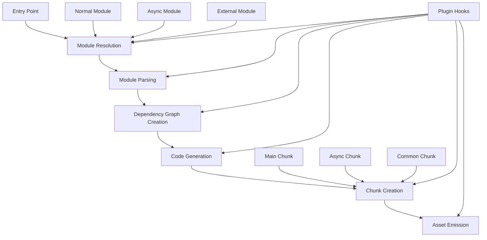

Now, let's go through each step of the webpack bundling process:

1. Entry Point: Webpack starts from the entry point(s) specified in the configuration.

2. Module Resolution: 
   - Webpack resolves each module (file) based on import/require statements.
   - It handles different module types: normal, async (dynamic imports), and external.

3. Module Parsing:
   - Each resolved module is parsed to understand its structure and dependencies.

4. Dependency Graph Creation:
   - Webpack builds a dependency graph based on the parsed modules and their relationships.

5. Code Generation:
   - Webpack generates code for each module, wrapping it in a function for proper execution in the bundle.

6. Chunk Creation:
   - Modules are grouped into chunks. There are typically three types:
     - Main chunk: Contains the entry point and its immediate dependencies.
     - Async chunks: Created for dynamically imported modules.
     - Common chunks: Shared code between multiple chunks (result of code splitting).

7. Asset Emission:
   - Webpack writes the generated chunks to output files.

Throughout this process, plugins can hook into various stages to modify behavior.

Now, let's create a simple example plugin that interacts with this process. Our plugin will:
1. Log the names of all modules being processed.
2. Force all dynamic imports to be included in the main chunk.


```javascript
class ModuleLoggerForceSyncPlugin {
  apply(compiler) {
    compiler.hooks.compilation.tap('ModuleLoggerForceSyncPlugin', (compilation) => {
      // Log module names
      compilation.hooks.buildModule.tap('ModuleLoggerForceSyncPlugin', (module) => {
        console.log(`Processing module: ${module.resource}`);
      });

      // Force dynamic imports to be included in the main chunk
      compilation.hooks.afterOptimizeChunks.tap('ModuleLoggerForceSyncPlugin', (chunks) => {
        const mainChunk = chunks.find(chunk => chunk.hasEntryModule());
        
        chunks.forEach(chunk => {
          if (chunk !== mainChunk && chunk.hasAsyncChunks()) {
            chunk.getModules().forEach(module => {
              if (module.type === 'javascript/dynamic') {
                mainChunk.addModule(module);
                chunk.removeModule(module);
              }
            });
          }
        });
      });
    });
  }
}

module.exports = ModuleLoggerForceSyncPlugin;

```

To use this plugin in your webpack configuration:

```javascript
const ModuleLoggerForceSyncPlugin = require('./ModuleLoggerForceSyncPlugin');

module.exports = {
  // ... other webpack config ...
  plugins: [
    new ModuleLoggerForceSyncPlugin()
  ]
};
```

This plugin demonstrates interaction with two key parts of the bundling process:

1. Module Processing: It logs the name of each module as it's being processed, giving insight into the module resolution and parsing stages.

2. Chunk Creation: It modifies the chunk creation process by forcing all dynamically imported modules into the main chunk, effectively converting async imports to sync ones.

Key points about webpack's bundling process:

1. Module Collection: Webpack starts from the entry point and recursively collects all imported modules, resolving their paths and content.

2. Module Connections: Modules are connected based on their import/require statements, forming a dependency graph.

3. Chunk Decisions: 
   - By default, webpack creates a main chunk for the entry point and its synchronous dependencies.
   - Async chunks are created for dynamic imports (`import()`).
   - Common chunks can be created by the SplitChunksPlugin based on shared dependencies.

4. Async Modules: These are typically loaded on-demand and result in separate chunks.

5. External Modules: These are declared as external in the webpack config and are not included in the bundle.

6. Chunk Splitting: This is primarily handled by the SplitChunksPlugin, which can be configured to split chunks based on various criteria like size, module sharing, etc.

This example provides a simplified view of webpack's bundling process. In practice, it's much more complex, with numerous optimizations and edge cases. The plugin system allows for extensive customization of this process, enabling developers to tailor webpack's behavior to their specific needs.
