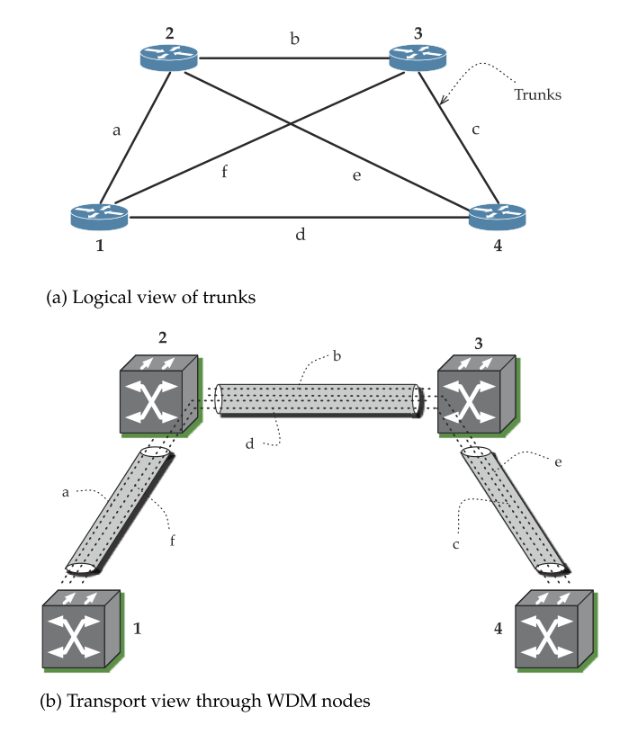

Within the context of the transport network, a transport network provider has its own
domain to meet the demand requirement through transport node equipment and transport network
links. It is important to point out that three different ISPs (each one marked as a separate autonomous
system) could conceivably use a single transport network provider, or an ISP
network may be carried by multiple transport network providers. Furthermore,
it is possible that a transport network provider would carry customer requirements for the Internet,
telephone network, or virtual private networks. Regardless, note that routing
within its own network remains the responsibility of each provider, be it an ISP, telephone service
provider, virtual private network provider, or a transport network provider.

To put it simply, the architecture of communication networks can be complicated: this is due to
not only the large number of nodes that can form a particular network, but also due to the traffic
network such as the Internet, the telephone network, and the transport network such as SONET or
WDM for carrying these traffic networks. In essence, a network (or layer) rides on another network,
i.e., a traffic network needs a transport network to connect the links needed for the traffic network; then,
within the transport network, multilayering is possible due to different data rates such as in optical
transport networks (OTNs). From a service point of view, a user of a traffic network does not “see” the
dependency on the transport network.

Based on mapping between just two layers in the network hierarchy, an important picture emerges.
For example, in the IP network, we see three node-diverse and link-wise logically diverse routes be-
tween nodes 1 and 4; they are 1–4, 1–2–4, and 1–3–4. By diverse we mean, there is no common link
(in the logical view) from one route to another. In reality, the actual topology view can be different at a
different layer. This is shown at the bottom of Figure 24.8 from which we see that the logical links are
actually all routed on the same transport network path, i.e., there is no diversity. Thus, a network may
look logically diverse in one layer but may not be diverse in another layer